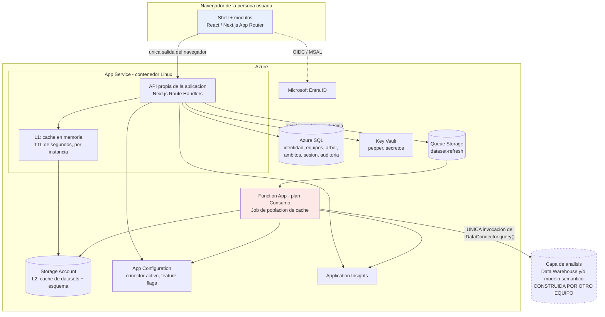
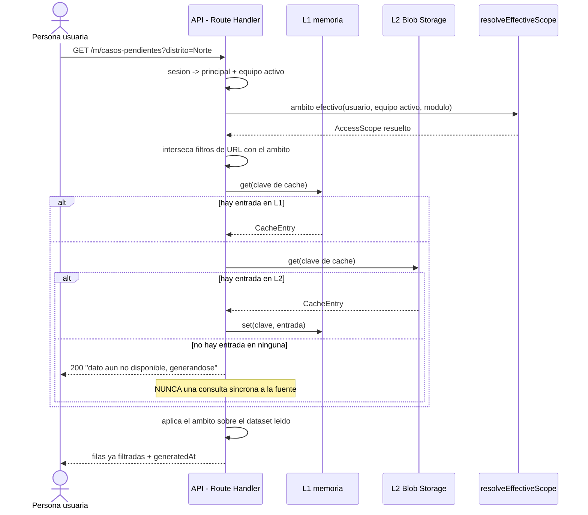
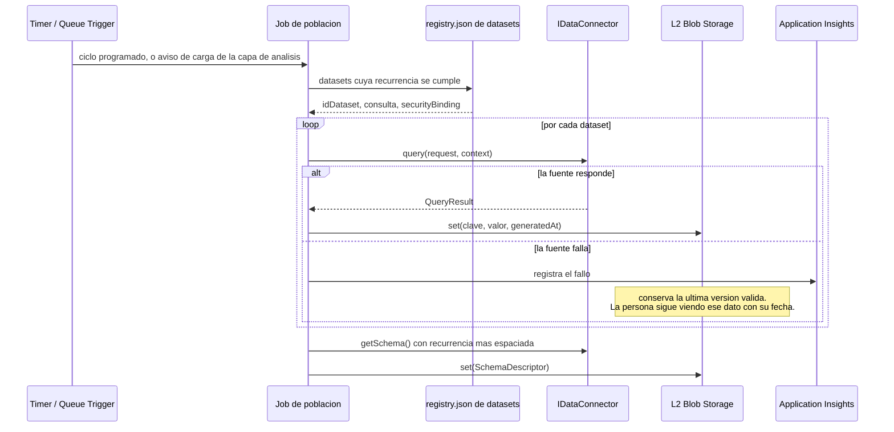
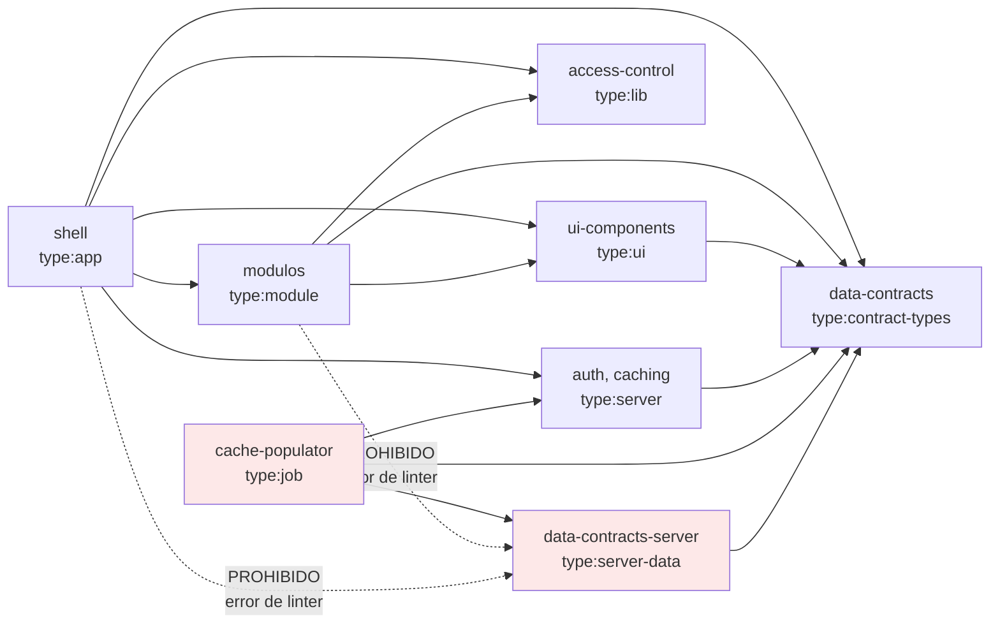

# Arquitectura de la capa de visualizacion

> Artefacto **A.1** del *gate* de la seccion 0 del contrato de ingenieria.
> Debe estar aprobado antes de implementar modulos de negocio.

## 1. Que es esta aplicacion

Una aplicacion web desplegada en **Azure App Service** que sustituye a Power BI como
herramienta de reporting institucional. **No** construye la capa de analisis (Data Warehouse
ni modelo semantico): esa la construye otro equipo en paralelo, y su forma final todavia no
esta decidida.

La consecuencia de diseño que gobierna todo lo demas: la aplicacion se desarrolla **hoy**
contra datos simulados y se re-ancla a la fuente real —`Sql`, `Xmla`, o ambas— cambiando un
valor de configuracion, sin tocar el codigo de los modulos.

## 2. Diagrama de contenedores

**Lo que el diagrama debe dejar evidente:**

1. Del navegador sale **una sola** flecha, y va a la API de esta misma aplicacion. No hay
   ninguna arista entre el navegador y la fuente de datos (principio 1).
2. Hacia la capa de analisis sale **una sola** flecha, y sale del job de poblacion. El App
   Service no la toca nunca (principio 2).
3. La fuente aparece punteada porque todavia no existe, y su forma final no esta decidida.

## 3. Camino de lectura: una persona abre un modulo

Notas que fijan decisiones, no adornos:

- **El filtro de seguridad se aplica siempre antes de que el dato salga hacia el cliente**,
  tanto si vino filtrado de la fuente como si se filtro aqui.
- Un parametro de URL solo puede **restringir** dentro del ambito ya permitido; la
  interseccion ocurre en el backend, para quien abre la URL, no para quien la genero.
- La ausencia de dato es un estado explicito de la interfaz, no un error ni un disparador
  de consulta.

## 4. Camino de poblacion: el unico que habla con la fuente

## 5. Por que el App Service no puede importar un conector

Esta es la consecuencia menos obvia del diseño y conviene que se revise explicitamente.

El endpoint `/health` debe reportar, segun la seccion 7, "conectividad al conector de datos
activo". La lectura ingenua seria que el shell instancie el conector y llame a
`testConnection()`. **Se descarta**: abriria en el proceso web justo el camino que el
principio 2 cierra, y volveria imposible verificar por trazas que el conector solo se invoca
desde el job.

En su lugar, el job de poblacion escribe un **latido** en el cache (resultado de su ultimo
`testConnection()`, ultima ejecucion exitosa, conector que la atendio) y `/health` lo lee de
ahi. El resultado es mas honesto: reporta la conectividad *realmente observada* por el
componente que consulta, no una conexion de prueba que solo demuestra que el App Service
alcanza la red.

Esto se hace cumplir por linter, no por disciplina: el proyecto `shell` esta etiquetado
`type:app` y no puede depender de `type:server-data`
(ver [`eslint.config.mjs`](../../eslint.config.mjs)). El unico proyecto autorizado es
`apps/cache-populator`, etiquetado `type:job`.

## 6. Grafo de dependencias permitido

Las dos aristas punteadas son las que convierten un criterio de aceptacion de la seccion 9 en
un error de compilacion. Se verifican con `npm run verify:boundaries`.

## 7. Recursos de Azure y por que cada uno

| Recurso | Para que | Nota de costo |
|---|---|---|
| App Service (Linux, contenedor) | La aplicacion | Standard S1 como piso funcional: es el tier mas barato con *slots* y autoescalado. Si existe un plan compartido con capacidad, se despliega ahi. |
| Storage Account | L2 del cache, esquema cacheado, assets estaticos, cola | Cobro por uso real, sin costo por estar disponible. Se reutiliza uno solo para todos esos fines. |
| Azure SQL | Identidad local, equipos, arbol de navegacion, ambitos, sesion, auditoria | Separada del Data Warehouse y **fuera del alcance** de `SqlDataConnector`. |
| Key Vault | *Pepper* de contraseñas locales, secretos | Acceso por Managed Identity, nunca variables de entorno planas. |
| App Configuration | Conector activo, *feature flags* por modulo | Tier Free. Permite cambiar de conector sin redeploy. |
| Application Insights | Trazas, auditoria de acceso, metricas de cache | Requisito desde el primer commit. |
| Function App (Consumo) | Job de poblacion de cache | Cobra por ejecucion. Ver ADR-004: los *WebJobs* continuos no son viables sobre contenedor Linux. |

**Fuera de alcance en esta fase:** Azure Cache for Redis (costo fijo permanente; queda
documentado como opcion de escalado futuro, y por eso el cache vive detras de `ICacheStore`
desde el dia 1) y Front Door/CDN (Fase 3, junto con la prueba de carga).
